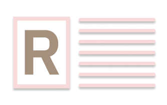

<!-- .github - @centauri-hacks/.github -->

<!-- Top section -->

  
   
  <h1 align="center" >Centauri Hackathon</h1>
  <h3 align="center" >An awesome hackathon coming soon!</h3>

 

<!-- Table of contents -->
# 🧂 Table of Contents
- [🧂 Table of Contents](#-table-of-contents)
- [🔮 About](#-about)
- [🚀 Contributing](#-contributing)

# 🔮 About
[We](https://github.com/orgs/centauri-hacks/people) are a group of developers aimed at bringing people's imaginations to life. Soon, we are starting a hackathon with an undecided theme. Please check back in soon for more details!

# 🚀 Contributing
You can create an issue or pull request on the repository if you have any issues with a rule or find any (stupid) mistakes.

<!-- Footer  -->

  
    👼
    <a href="https://github.com/centauri-hacks">@centauri-hacks</a>
  
  ⁄
  
    <a href="https://github.com/centauri-hacks/.github">.github</a>
  
  •
  👮 MIT License
  •
  <a href="#-table-of-contents">Jump to Top</a>

